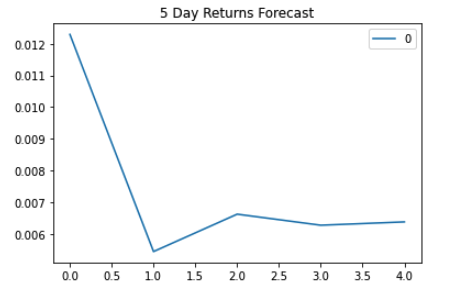
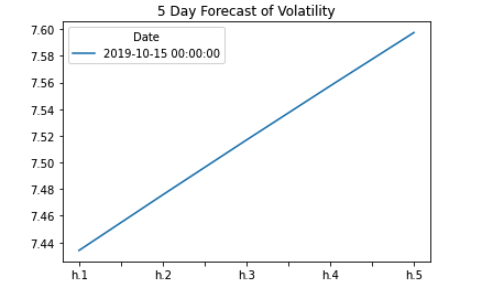
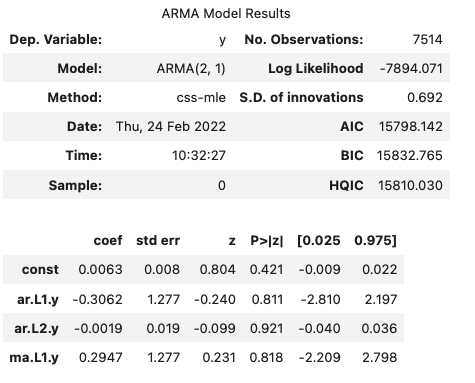
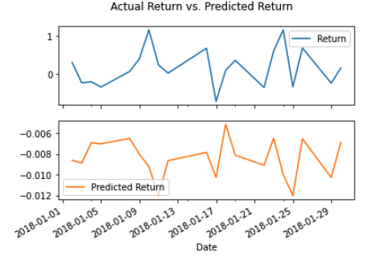

# Time_Series_Linear_Regression_Forecasting
Time Series Homework

## Assignment Background

In this assignment, we will predict future movements in the value of the Japanese yen versus the U.S. dollar. We will provide the following tasks to forecast future outcomes:

1. Time Series Forecasting
2. Linear Regression Modeling

## Project Summary

### Time-Series Forecasting

In this notebook, I loaded historical Dollar-Yen exchange rate futures data and applied time series analysis and modeling to determine whether there is any predictable behavior.

I completed the following tasks:

1. Decomposition using a Hodrick-Prescott Filter (Decompose the Settle price into trend and noise).
2. Forecasting Returns using an ARMA Model.
3. Forecasting the Settle Price using an ARIMA Model.
4. Forecasting Volatility with GARCH.

Based on the time series analysis and modeling, I answered the following questions:

## *Based on your time series analysis, would you buy the yen now?*
### I do not have a lot of confidence in these models, as I explain below. However, if i take the ARMA and ARIMA models at face value, I would not buy the yen now, as two out of the three models show a downward trend over the next 5 trading days. I would hold off until my rolling 5 day forecast shows an upward trend. And, I would like to see more confidence in the AIC/BIC/P>|z| output,again as I explain below.

## *Is the risk of the yen expected to increase or decrease?*
### Looking at the GARCH model, we see that volitility will increase over the next 5 days.

## *Based on the model evaluation, would you feel confident in using these models for trading?*
### Based on the AIC/BIC/P>|z| output values, I do not have confidence in these models.  For example, the chart below for the ARMA model indicates a high AIC and BIC, which denotes unconfidence in the model. It also show a high, well above the 0.05 confidence rating, P-value at a combined rate of 0.421.

### Linear Regression Forecasting

In this notebook, I built a Scikit-Learn linear regression model to predict Yen futures returns with *lagged* Yen futures returns and categorical calendar seasonal effects (e.g., day-of-week or week-of-year seasonal effects).

I completed the following tasks:

1. Data Preparation (Creating Returns and Lagged Returns and splitting the data into training and testing data)
2. Fitting a Linear Regression Model.
3. Making predictions using the testing data.
4. Out-of-sample performance.
5. In-sample performance.

Based on the linear regression analysis and modeling I answered the following question:

## Does this model perform better or worse on out-of-sample data compared to in-sample data?
### These conclusions are based on training, and subsequent testing, the model based on one variable, one day laggard return. I would like to see more independent variables used to get more confidence in forecasting our dependent "Y" tomorrow's return. But overall, we were able to predict a forecast within one standard deviation in both the in and out of sample data sets. For In-Sample data (training) we had a RMSE value of 0.59636 and a standard deviation of 0.5959637 - well within one STD. Likewise, for Out-of-Sample (testing) our RMSE value was 0.41548 and our standard deviation was 0.41524 - again, within one STD. Note, our testing data actually had a lower standard deviation and RMSE by about 25%, which is significant.

### Lastly, we can see with the chart of train and test, we are fairly accurate with general trends, with noticable discrepencies from January 2nd through the 10th. Otherwise, we are predicting fairly accurately.
